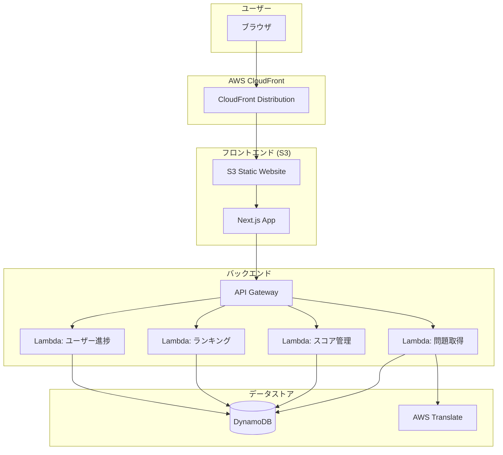
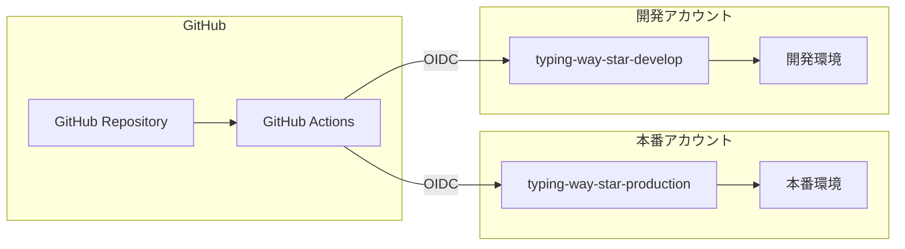

# 設計文書

## 概要

Typing Way Starは、3Dドライブ体験と翻訳タイピングを組み合わせたWebゲームです。AWS Free Tierを最大限活用したサーバーレスアーキテクチャを採用し、コスト効率的でスケーラブルなシステムを構築します。フロントエンドはNext.js + Three.jsで3D体験を提供し、バックエンドはGo + AWS Lambdaで高速なAPI応答を実現します。

## アーキテクチャ

### システム全体構成



### マルチアカウント構成



## コンポーネントと インターフェース

### フロントエンドコンポーネント

#### 1. ゲームエンジンコンポーネント
```typescript
interface GameEngine {
  // 3D描画エンジン
  renderer: THREE.WebGLRenderer;
  scene: THREE.Scene;
  camera: THREE.PerspectiveCamera;
  
  // ゲーム状態管理
  gameState: GameState;
  vehicleController: VehicleController;
  environmentRenderer: EnvironmentRenderer;
}

interface GameState {
  currentStage: number;
  currentSpeed: number;
  score: number;
  combo: number;
  timeRemaining: number;
  translationAccuracy: number;
}
```

#### 2. 翻訳システムコンポーネント
```typescript
interface TranslationSystem {
  currentProblem: Problem;
  userInput: string;
  accuracy: number;
  
  evaluateTranslation(input: string): TranslationResult;
  getHints(): string[];
}

interface Problem {
  id: string;
  sourceText: string;
  sourceLang: 'ja' | 'en';
  targetLang: 'ja' | 'en';
  correctAnswers: string[];
  alternatives: string[];
  difficulty: 'easy' | 'medium' | 'hard';
}
```

#### 3. UIコンポーネント階層
```
App
├── RouteMap
│   ├── StageNode (×8)
│   └── ProgressIndicator
├── GameScreen
│   ├── GameCanvas (Three.js)
│   ├── TranslationPanel
│   ├── ScoreDisplay
│   └── GameHUD
├── VehicleSelection
├── Settings
└── Rankings
```

### バックエンドAPI設計

#### 1. 問題取得API
```go
// GET /api/problems
type GetProblemsRequest struct {
    Mode       int    `json:"mode" validate:"min=0,max=1"`        // 0:単語, 1:会話
    Difficulty int    `json:"difficulty" validate:"min=0,max=2"`  // 0:easy, 1:medium, 2:hard
    Direction  string `json:"direction" validate:"oneof=ja_to_en en_to_ja"`
    Count      int    `json:"count" validate:"min=1,max=10"`
}

type GetProblemsResponse struct {
    Problems []Problem `json:"problems"`
}
```

#### 2. スコア管理API
```go
// POST /api/scores
type SubmitScoreRequest struct {
    UserID           string  `json:"user_id" validate:"required"`
    StageNumber      int     `json:"stage_number" validate:"min=1,max=8"`
    Score            int     `json:"score" validate:"min=0"`
    WPM              float64 `json:"wpm" validate:"min=0"`
    Accuracy         float64 `json:"accuracy" validate:"min=0,max=100"`
    CompletionTime   int     `json:"completion_time" validate:"min=0"`
    MaxCombo         int     `json:"max_combo" validate:"min=0"`
    IsCompleted      bool    `json:"is_completed"`
    Mode             int     `json:"mode" validate:"min=0,max=1"`
    Difficulty       int     `json:"difficulty" validate:"min=0,max=2"`
    TranslationDir   string  `json:"translation_direction" validate:"oneof=ja_to_en en_to_ja"`
}
```

#### 3. ランキングAPI
```go
// GET /api/rankings
type GetRankingsRequest struct {
    StageNumber      *int    `json:"stage_number,omitempty" validate:"omitempty,min=1,max=8"`
    Mode             *int    `json:"mode,omitempty" validate:"omitempty,min=0,max=1"`
    Difficulty       *int    `json:"difficulty,omitempty" validate:"omitempty,min=0,max=2"`
    TranslationDir   *string `json:"translation_direction,omitempty" validate:"omitempty,oneof=ja_to_en en_to_ja"`
    Limit            int     `json:"limit" validate:"min=1,max=50"`
}

type GetRankingsResponse struct {
    Rankings []RankingEntry `json:"rankings"`
    UserRank *RankingEntry  `json:"user_rank,omitempty"`
}
```

## データモデル

### DynamoDBテーブル設計

#### 1. wordsテーブル
```
PK: word_id (String)
Attributes:
- mode (Number): 0=単語, 1=会話
- difficulty (Number): 0=easy, 1=medium, 2=hard
- created_at (String): ISO 8601
- updated_at (String): ISO 8601

GSI1:
- PK: mode#difficulty (String): "0#0", "0#1", etc.
- SK: created_at (String)
```

#### 2. translationsテーブル
```
PK: word_id (String)
SK: lang (String): "ja" or "en"
Attributes:
- text (String): 翻訳テキスト
- alternatives (List<String>): 代替表現リスト
```

#### 3. user_progressテーブル
```
PK: user_id (String)
SK: difficulty#direction (String): "0#ja_to_en", "1#en_to_ja", etc.
Attributes:
- unlocked_stages (List<Number>): [1, 2, 3, ...]
- completed_stages (List<Number>): [1, 2, ...]
- current_stage (Number): 現在挑戦中ステージ
- current_stage_retry_count (Number): リトライ回数
- total_score (Number): 累計スコア
- pre_challenge_score (Number): 挑戦前スコア
- best_scores (Map<String, Number>): {"stage_1": 1500, ...}
- best_times (Map<String, Number>): {"stage_1": 120, ...}
- created_at (String)
- updated_at (String)
```

#### 4. scoresテーブル（ランキング用）
```
PK: score_id (String): UUID
Attributes:
- user_name (String)
- user_id (String)
- stage_number (Number)
- score (Number)
- wpm (Number)
- accuracy (Number)
- completion_time (Number)
- max_combo (Number)
- retry_count (Number)
- is_completed (Boolean)
- mode (Number)
- difficulty (Number)
- translation_direction (String)
- created_at (String)

GSI1 (ランキング用):
- PK: ranking_key (String): "stage_1_0_0_ja_to_en" (stage_mode_difficulty_direction)
- SK: score (Number): 降順ソート用
```

### データアクセスパターン

#### 1. 問題取得
```
Query: words table GSI1
PK = "mode#difficulty"
Limit = requested count
```

#### 2. ランキング取得
```
Query: scores table GSI1
PK = "stage_{stage}_mode_{mode}_difficulty_{difficulty}_direction_{direction}"
SK = score (descending)
Limit = 50
```

#### 3. ユーザー進捗管理
```
GetItem: user_progress table
PK = user_id
SK = "difficulty#direction"
```

## エラーハンドリング

### フロントエンドエラー処理

#### 1. ネットワークエラー
```typescript
class APIClient {
  async request<T>(endpoint: string, options: RequestOptions): Promise<T> {
    try {
      const response = await fetch(endpoint, options);
      if (!response.ok) {
        throw new APIError(response.status, await response.text());
      }
      return await response.json();
    } catch (error) {
      if (error instanceof APIError) {
        throw error;
      }
      // ネットワークエラーの場合
      throw new NetworkError('ネットワーク接続に問題があります');
    }
  }
}
```

#### 2. ゲーム状態エラー
```typescript
class GameStateManager {
  validateGameState(state: GameState): void {
    if (state.currentStage < 1 || state.currentStage > 8) {
      throw new GameStateError('無効なステージ番号です');
    }
    if (state.timeRemaining < 0) {
      throw new GameStateError('制限時間が無効です');
    }
  }
}
```

### バックエンドエラー処理

#### 1. 入力検証エラー
```go
type ValidationError struct {
    Field   string `json:"field"`
    Message string `json:"message"`
}

type ErrorResponse struct {
    Error       string            `json:"error"`
    Validations []ValidationError `json:"validations,omitempty"`
}

func validateRequest(req interface{}) []ValidationError {
    validate := validator.New()
    err := validate.Struct(req)
    if err == nil {
        return nil
    }
    
    var validationErrors []ValidationError
    for _, err := range err.(validator.ValidationErrors) {
        validationErrors = append(validationErrors, ValidationError{
            Field:   err.Field(),
            Message: getValidationMessage(err),
        })
    }
    return validationErrors
}
```

#### 2. DynamoDBエラー
```go
func handleDynamoDBError(err error) error {
    switch {
    case errors.Is(err, dynamodb.ErrItemNotFound):
        return NewNotFoundError("データが見つかりません")
    case errors.Is(err, dynamodb.ErrConditionalCheckFailed):
        return NewConflictError("データが既に更新されています")
    case errors.Is(err, dynamodb.ErrThrottling):
        return NewServiceUnavailableError("一時的にサービスが利用できません")
    default:
        return NewInternalError("内部エラーが発生しました")
    }
}
```

## テスト戦略

### フロントエンドテスト

#### 1. 統合テスト（Playwright）
```typescript
// tests/game-flow.spec.ts
test('翻訳ドライブゲーム完全フロー', async ({ page }) => {
  // Given: ゲーム開始
  await page.goto('/');
  
  // When: 設定選択
  await page.click('[data-testid="ja-to-en"]');
  await page.click('[data-testid="easy"]');
  await page.click('[data-testid="word-mode"]');
  
  // Then: ルートマップが表示される
  await expect(page.locator('[data-testid="route-map"]')).toBeVisible();
  
  // When: ステージ1を選択
  await page.click('[data-testid="stage-1"]');
  
  // Then: 車両選択画面が表示される
  await expect(page.locator('[data-testid="vehicle-selection"]')).toBeVisible();
  
  // When: バランス車両を選択してゲーム開始
  await page.click('[data-testid="balance-vehicle"]');
  await page.click('[data-testid="start-game"]');
  
  // Then: ゲーム画面が表示され、問題が出現する
  await expect(page.locator('[data-testid="game-canvas"]')).toBeVisible();
  await expect(page.locator('[data-testid="translation-problem"]')).toBeVisible();
  
  // When: 翻訳問題に回答
  const problemText = await page.locator('[data-testid="source-text"]').textContent();
  await page.fill('[data-testid="answer-input"]', 'Hello');
  await page.press('[data-testid="answer-input"]', 'Enter');
  
  // Then: スコアが更新され、車両が加速する
  await expect(page.locator('[data-testid="score"]')).not.toHaveText('0');
  await expect(page.locator('[data-testid="speed-meter"]')).toHaveAttribute('data-speed', /[1-9]/);
});
```

#### 2. コンポーネントテスト
```typescript
// tests/components/TranslationPanel.test.tsx
describe('TranslationPanel', () => {
  test('翻訳精度がリアルタイムで更新される', async () => {
    const mockProblem = {
      sourceText: 'こんにちは',
      correctAnswers: ['Hello', 'Hi'],
      alternatives: ['Hey', 'Good morning']
    };
    
    render(<TranslationPanel problem={mockProblem} />);
    
    const input = screen.getByTestId('answer-input');
    
    // 部分入力時
    fireEvent.change(input, { target: { value: 'Hel' } });
    expect(screen.getByTestId('accuracy')).toHaveTextContent('60%');
    
    // 完全一致時
    fireEvent.change(input, { target: { value: 'Hello' } });
    expect(screen.getByTestId('accuracy')).toHaveTextContent('100%');
    
    // 類義語入力時
    fireEvent.change(input, { target: { value: 'Hi' } });
    expect(screen.getByTestId('accuracy')).toHaveTextContent('100%');
  });
});
```

### バックエンドテスト

#### 1. 単体テスト
```go
// internal/service/translation_test.go
func TestTranslationService_EvaluateAccuracy(t *testing.T) {
    tests := []struct {
        name           string
        correctAnswers []string
        userInput      string
        expected       float64
    }{
        {
            name:           "完全一致",
            correctAnswers: []string{"Hello"},
            userInput:      "Hello",
            expected:       100.0,
        },
        {
            name:           "類義語一致",
            correctAnswers: []string{"Hello", "Hi"},
            userInput:      "Hi",
            expected:       100.0,
        },
        {
            name:           "部分一致",
            correctAnswers: []string{"Hello"},
            userInput:      "Hel",
            expected:       60.0,
        },
        {
            name:           "不一致",
            correctAnswers: []string{"Hello"},
            userInput:      "Goodbye",
            expected:       0.0,
        },
    }

    service := NewTranslationService()
    
    for _, tt := range tests {
        t.Run(tt.name, func(t *testing.T) {
            accuracy := service.EvaluateAccuracy(tt.correctAnswers, tt.userInput)
            assert.Equal(t, tt.expected, accuracy)
        })
    }
}
```

#### 2. 統合テスト
```go
// tests/integration/api_test.go
func TestGetProblems_Integration(t *testing.T) {
    // Given: テスト用DynamoDB環境
    dynamoClient := setupTestDynamoDB(t)
    seedTestData(t, dynamoClient)
    
    handler := NewGetProblemsHandler(dynamoClient)
    
    // When: 問題取得APIを呼び出し
    req := GetProblemsRequest{
        Mode:       0, // 単語モード
        Difficulty: 0, // Easy
        Direction:  "ja_to_en",
        Count:      5,
    }
    
    resp, err := handler.Handle(context.Background(), req)
    
    // Then: 期待される結果が返される
    assert.NoError(t, err)
    assert.Len(t, resp.Problems, 5)
    assert.Equal(t, 0, resp.Problems[0].Mode)
    assert.Equal(t, 0, resp.Problems[0].Difficulty)
}
```

## セキュリティ設計

### 1. 入力検証
```go
// バックエンド入力検証
type ScoreRequest struct {
    UserID    string  `json:"user_id" validate:"required,max=50,alphanum"`
    Score     int     `json:"score" validate:"min=0,max=999999"`
    WPM       float64 `json:"wpm" validate:"min=0,max=1000"`
    Accuracy  float64 `json:"accuracy" validate:"min=0,max=100"`
}

func validateAndSanitize(req *ScoreRequest) error {
    // 構造体バリデーション
    if err := validator.New().Struct(req); err != nil {
        return err
    }
    
    // HTMLエスケープ
    req.UserID = html.EscapeString(req.UserID)
    
    // スコア改ざんチェック
    if req.Score > calculateMaxPossibleScore(req.WPM, req.Accuracy) {
        return errors.New("不正なスコアです")
    }
    
    return nil
}
```

### 2. フロントエンドセキュリティ
```typescript
// XSS対策
const sanitizeInput = (input: string): string => {
  return DOMPurify.sanitize(input);
};

// CSRF対策
const apiClient = axios.create({
  xsrfCookieName: 'XSRF-TOKEN',
  xsrfHeaderName: 'X-XSRF-TOKEN',
});

// Content Security Policy
const cspHeader = {
  'Content-Security-Policy': 
    "default-src 'self'; " +
    "script-src 'self' 'unsafe-inline'; " +
    "style-src 'self' 'unsafe-inline'; " +
    "img-src 'self' data: https:; " +
    "connect-src 'self' https://api.typing-way-star.kumarabo.com;"
};
```

### 3. AWS WAF設定
```hcl
# terraform/modules/waf/main.tf
resource "aws_wafv2_web_acl" "main" {
  name  = "typing-way-star-waf"
  scope = "CLOUDFRONT"

  default_action {
    allow {}
  }

  rule {
    name     = "RateLimitRule"
    priority = 1

    action {
      block {}
    }

    statement {
      rate_based_statement {
        limit              = 2000
        aggregate_key_type = "IP"
      }
    }

    visibility_config {
      cloudwatch_metrics_enabled = true
      metric_name                = "RateLimitRule"
      sampled_requests_enabled   = true
    }
  }

  rule {
    name     = "AWSManagedRulesCommonRuleSet"
    priority = 2

    override_action {
      none {}
    }

    statement {
      managed_rule_group_statement {
        name        = "AWSManagedRulesCommonRuleSet"
        vendor_name = "AWS"
      }
    }

    visibility_config {
      cloudwatch_metrics_enabled = true
      metric_name                = "CommonRuleSetMetric"
      sampled_requests_enabled   = true
    }
  }
}
```

## パフォーマンス最適化

### 1. フロントエンド最適化
```typescript
// 3D描画最適化
class GameRenderer {
  private renderer: THREE.WebGLRenderer;
  private scene: THREE.Scene;
  
  constructor() {
    this.renderer = new THREE.WebGLRenderer({
      antialias: false, // パフォーマンス優先
      powerPreference: "high-performance"
    });
    
    // ローポリゴンモデル使用
    this.loadOptimizedModels();
  }
  
  private loadOptimizedModels() {
    // 車両モデル: 500ポリゴン以下
    // 環境モデル: 1000ポリゴン以下
    // テクスチャ: 512x512以下
  }
  
  render() {
    // フレームレート制御
    requestAnimationFrame(() => {
      if (this.shouldRender()) {
        this.renderer.render(this.scene, this.camera);
      }
    });
  }
  
  private shouldRender(): boolean {
    // 60FPS維持のための描画スキップ判定
    return performance.now() - this.lastRenderTime > 16.67;
  }
}
```

### 2. バックエンド最適化
```go
// Lambda最適化
func init() {
    // コールドスタート対策
    initializeConnections()
}

func initializeConnections() {
    // DynamoDB接続プール
    dynamoClient = dynamodb.New(session.Must(session.NewSession()))
    
    // 翻訳サービス接続
    translateClient = translate.New(session.Must(session.NewSession()))
}

// レスポンス最適化
func optimizeResponse(data interface{}) ([]byte, error) {
    // JSON圧縮
    var buf bytes.Buffer
    encoder := json.NewEncoder(&buf)
    encoder.SetEscapeHTML(false)
    
    if err := encoder.Encode(data); err != nil {
        return nil, err
    }
    
    // gzip圧縮
    return gzipCompress(buf.Bytes())
}
```

### 3. DynamoDB最適化
```go
// バッチ処理最適化
func (r *Repository) GetProblemsOptimized(mode, difficulty int, count int) ([]Problem, error) {
    // GSIを使用した効率的なクエリ
    input := &dynamodb.QueryInput{
        TableName:              aws.String("words"),
        IndexName:              aws.String("mode-difficulty-index"),
        KeyConditionExpression: aws.String("mode_difficulty = :md"),
        ExpressionAttributeValues: map[string]*dynamodb.AttributeValue{
            ":md": {S: aws.String(fmt.Sprintf("%d#%d", mode, difficulty))},
        },
        Limit: aws.Int64(int64(count)),
        // 読み取り整合性を最終的整合性に設定（パフォーマンス優先）
        ConsistentRead: aws.Bool(false),
    }
    
    result, err := r.dynamoClient.Query(input)
    if err != nil {
        return nil, err
    }
    
    return r.unmarshalProblems(result.Items)
}
```

この設計文書では、要件を満たすための技術的な実装方針、アーキテクチャ、データモデル、エラーハンドリング、テスト戦略、セキュリティ、パフォーマンス最適化について詳細に定義しました。AWS Free Tierを最大限活用しながら、スケーラブルで保守性の高いシステムを構築する設計となっています。